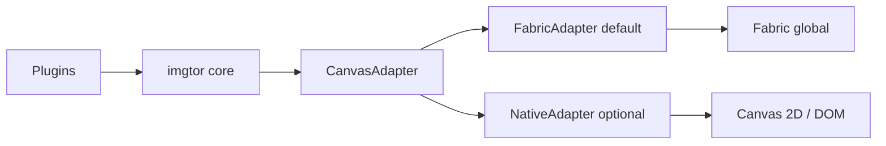

# Soft migration: Fabric.js → CanvasAdapter

This plan matches the **plugin hardening** in [`PLUGIN_API.md`](./PLUGIN_API.md): public **`imgtor`** API and plugin **`initialize` / `destroy`** stay stable while internals move behind an adapter.

## Goals

- Reduce direct **`fabric.*`** usage in core and plugins without breaking behavior.
- Introduce an internal **CanvasAdapter** boundary so features can move incrementally from Fabric to first-party code.
- Ship in **small PRs** with tests and optional flags; **Fabric remains default** until parity is proven.

## Target shape

## Phases

### Phase A — Boundary extraction (no behavior change)

- **Done (initial slice):** **`lib/js/core/canvas-adapter-fabric.js`** exposes **`imgtor.CanvasAdapterFabric`** with **`createCanvas`** and **`createLockedImage`**. Core uses it for viewport/source **`fabric.Canvas`** construction, source **`fabric.Image`**, and **`refresh()`** clone images. Further operations (dimensions, centering in adapter) remain in core for now.
- Optional follow-up in this phase: expand the adapter surface (e.g. wrap **`setWidth` / `centerObject`**) and/or add a standalone **`canvas-adapter.js`** typedef module.
- Unit tests: **`tests/unit/core-canvas-adapter-fabric.test.js`** + existing core tests as parity gates.

### Phase B — Plugin decoupling

- **Rotate**, **history**, **save**: depend only on core + adapter surfaces (no stray `fabric` in plugin code where avoidable).
- **Crop**: extract **pure geometry / ratio / clamp** helpers first; keep Fabric for rendering and hit-testing until later phases.

### Phase C — Native prototype (opt-in)

- **`options.adapter: 'fabric' | 'native'`** (default **`fabric`**).
- Implement **NativeAdapter** for a **subset** (e.g. load, rotate, export) behind the flag.
- Parity tests: same flows as Fabric path for supported operations.

### Phase D — Progressive ownership

- Move crop interaction in slices; keep **FabricAdapter** as fallback until native path meets stability and coverage targets.

## Risk controls

- Default stays **Fabric** until acceptance criteria pass (see below).
- Each PR: **`npm run lint`**, **`npm run test:unit`**, **`npm run test:coverage`**, **`npm run test:e2e`**.
- Playwright visual baselines for toolbar / crop when UI changes.

## Acceptance checkpoint (before changing default)

- Rotate / save / history work on **native** adapter without public API breaks.
- Unit + e2e pass rate matches Fabric baseline for **two consecutive** PRs.
- Coverage stays at or above **`vitest.config.js`** thresholds.
- Measurable benefit: fewer Fabric touchpoints, simpler mocks, or smaller critical path.

If criteria are not met, stop at **“adapter boundary + Fabric default”** and treat native as experimental.

## Relation to plugins

Third-party plugins should continue to use **`this.imgtor`** and, during migration, any **documented adapter accessors** exposed on the instance—**not** raw `fabric` globals—so they survive a Fabric-less default in the future.
